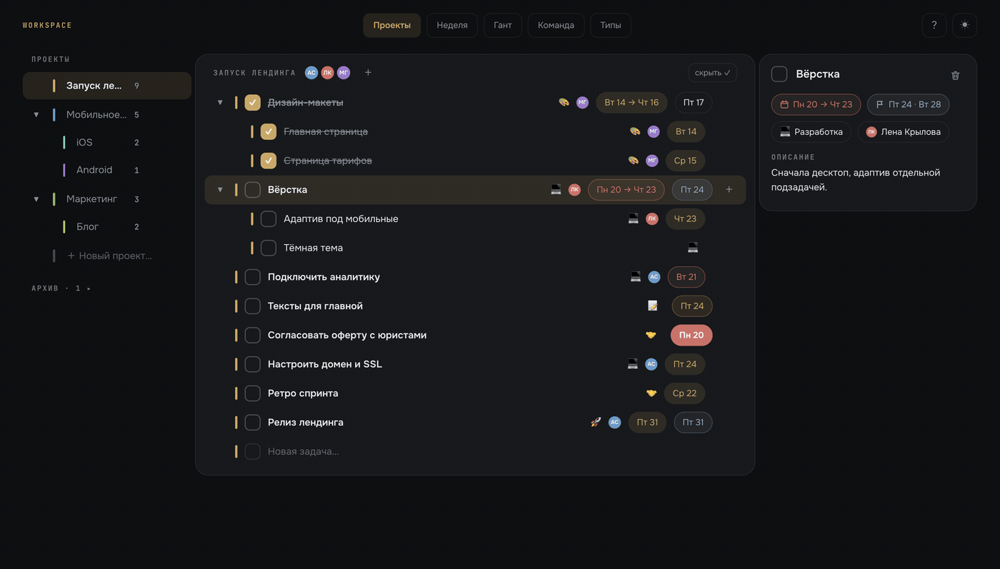

# WorkSpace

Локальный однопользовательский планировщик: дерево проектов и задач,
недельная доска, диаграмма Ганта, команда и типы задач. Один Go-бинарь
со встроенным фронтом, данные — в SQLite-файле рядом.



## 🚀 Запуск

```sh
docker compose up --build -d    # приложение на http://localhost:8787
# со старым Compose V1: docker-compose up --build -d
```

База — SQLite-файл в `./data/` (переживает пересборку и перезапуск);
при каждом старте сервер кладёт копию в `data/backups/` (последние 10).
Удаление везде мягкое: записи помечаются и исчезают из списков, но
физически остаются в базе.

Аутентификации нет — инструмент рассчитан на localhost одного человека;
не публикуй порт наружу.

## 🧭 Разделы

### Проекты

Слева — дерево проектов (вложенность без ограничений, drag: середина —
под-проектом, край — сиблингом; цвет — кликом по полоске). Справа —
дерево задач выбранного проекта и инспектор.

- Drag по дереву задач: середина строки — внутрь, верх/низ — сиблингом;
  задачу можно бросить на проект в сайдбаре — уедет в его корень, или на
  полоску-неделю внизу (появляется при перетаскивании) — получит план.
- Инспектор: название, план, дедлайны, тип, исполнитель, описание;
  название и описание сохраняются сами через паузу набора. Удаление —
  корзина, второй клик подтверждает. Выбор переживает перезагрузку.
- Пустой проект удаляется, непустой — только в архив (рекурсивно);
  секция «Архив» внизу сайдбара, оттуда можно вернуть.
- Отметки «сделано» полностью ручные — никаких автокаскадов. Тумблер
  «скрыть ✓» прячет сделанные ветки. Ширины колонок тянутся.

### Неделя

Колонки Пн–Вс (тумблер «Сб–Вс» прячет выходные, «2 нед» добавляет
следующую неделю второй строкой), листание ◂ ▸.

- Быстрый ввод в каждом дне (точка слева — выбор проекта), drag задач
  между днями и внутри дня, клик по карточке — попап с деталями.
- Многодневная задача (план «с … по …») видна в каждом дне диапазона:
  полная карточка в первый день, «продолжения» с прогрессом k/N дальше.
- Плашка «Просрочено»: «Сорван дедлайн» (по жёсткому) и «Не сделано в
  запланированный день» — с быстрыми действиями «на сегодня» / «снять».

### Гант

Проекты — полосы на шкале дней (иерархия раскрывается), задачи внутри:
полоса — диапазон работы, ромб — один день, полый кружок — мягкий
дедлайн, флажок — жёсткий. Всё таскается мышью: полоса целиком, края
по отдельности, маркеры дедлайнов тоже. Линия «сегодня», выходные
подсвечены, архивные проекты — по тумблеру.

### Команда и Типы

- Люди с цветом, аватаркой и ролью; справочник ролей рядом. Порядок —
  перетаскиванием, он отражается во всех списках.
- У проекта — несколько участников (стек аватарок в шапке дерева).
- Типы задач со смайликами (пресеты или любой свой — ⌃⌘Space); тип
  виден смайликом в дереве, неделе и на Ганте.

## 🔁 Повторяющиеся задачи

Чип «повтор» в карточке — дни недели (пн … вс, можно несколько). В
структуре живёт одна задача серии: отметка ✓ создаёт следующую на
ближайший день правила (переезжают описание, тип, исполнитель, правило
и подзадачи со снятыми галочками). Перенос повторяющейся ничего не
создаёт: задача просто едет на новую дату вместе с правилом, а будущие
вхождения пересчитываются от неё; новая задача серии появляется только
после отметки ✓. Поменять расписание — в чипе повтора. Будущие
вхождения видны полупрозрачными
призраками в неделе и контурными ромбиками на Ганте. На Ганте вся
серия — одна строка: приглушённые точки прошлых вхождений, живое —
фигурой, будущее — призраками.

## ⚑ Двойной дедлайн

У задачи кроме плана есть **мягкий** дедлайн (цель) и **жёсткий**
(крайний срок) — попап с вкладками «мягкий | жёсткий». Компактный чип
показывает ближайший рубеж и красится по фазе:

| Фаза | Цвет |
|---|---|
| до мягкого | синеватый |
| мягкий позади, жёсткий впереди | янтарный |
| жёсткий позади | красный |

Сделанные задачи — нейтральны. Сервер держит инвариант
план ≤ мягкий ≤ жёсткий.

## ⌨️ Поиск и клавиши

- `⌘K` — палитра поиска по задачам и активным проектам, Enter ведёт в
  дерево с подсветкой найденного.
- `↑`/`↓` — по строкам дерева в «Проектах», инспектор следует.
- `1`–`5` — разделы, `T` — текущая неделя, `Esc` — закрыть попап.
- Кнопка «?» в шапке — шпаргалка клавиш и жестов. Тумблер темы рядом
  (тёмная — дефолт).

## 🛠 Разработка

```sh
make dev-api    # go run, порт 8787
make dev-front  # vite dev, проксирует /api на 8787
make test       # go vet + go test, tsc + vitest
make build      # фронт + бэк без докера -> bin/workspace
make run        # собрать и запустить bin/workspace (порт 8787)
```

Стек: Go (net/http, modernc.org/sqlite — без CGO), React 19 +
TypeScript + Vite + Tailwind v4. Фронт собирается в `backend/web/dist`
и встраивается в бинарь через `embed.FS`; миграции — embedded SQL.
Спеки итераций — в `docs/superpowers/specs/`.

## 📄 Лицензия

MIT — см. [LICENSE](LICENSE).
